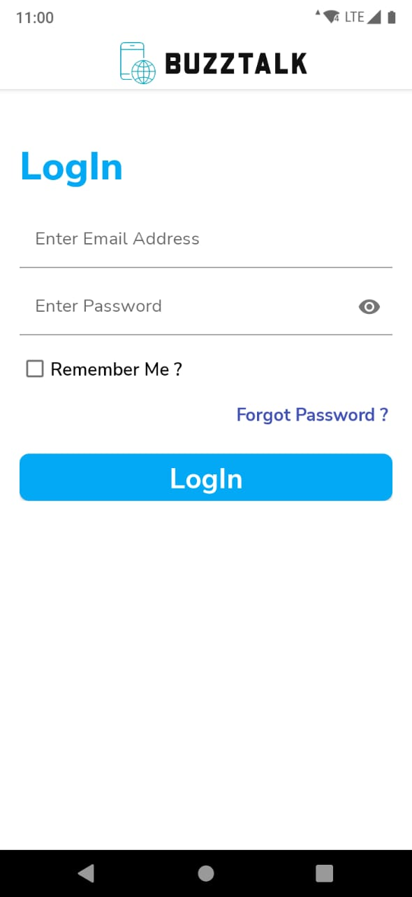

# BuzzTalk - An Android Based Social Media App to Grow Your Network

## App Features

- **User Authentication** -  Different types of user like University, Companies , Students , etc, can login and register on the platform.
- **Send and Accept Requests** - You can follow or send a connection request to anyone
- **Real Time Chat and Video** -  Chat and Video Call with your connections in real time
- **User feed** - Like , Comment and Share other posts. Your interactions Will Be shown to your connections. 
- **Tag Your Friends** - You can Tag your connections or anyone on the platform
- **Push Notifications** - You will be notified on a new message or if someone tags you in a post .

## As of now , the latest version of the app is in _stable-new_ branch

## 📸 Screenshots

|   |   |   |
|---|---|---|
|||

|   |   |   |
|---|---|---|
|||

|   |   |   |
|---|---|---|
|||

|   |   |   |
|---|---|---|
|||

|   |   |   |
|---|---|---|
|||

|   |   |   |
|---|---|---|
|||

|   |   |   |
|---|---|---|
|||

## Built With 🛠
- [Kotlin](https://kotlinlang.org/) - First class and official programming language for Android development.
- [Coroutines](https://kotlinlang.org/docs/reference/coroutines-overview.html) - For All Asynchronous operations in project
- [Android Architecture Components](https://developer.android.com/topic/libraries/architecture) - Collection of libraries that help you design robust, testable, and maintainable apps.
  - [ViewModel](https://developer.android.com/topic/libraries/architecture/viewmodel) - Stores UI-related data that isn't destroyed on UI changes. 
  - [ViewBinding](https://developer.android.com/topic/libraries/view-binding) - Generates a binding class for each XML layout file present in that module and allows you to more easily write code that interacts with views.
  - [LiveData](https://developer.android.com/topic/libraries/architecture/livedata) - LiveData is an observable data holder class. Unlike a regular observable, LiveData is lifecycle-aware, meaning it respects the lifecycle of other app components, such as activities, fragments, or services.
  - [Navigation Component](https://developer.android.com/guide/navigation) - Allows to specify navigation throughout app using an XML graph or via a graph editor.
- [Dependency Injection](https://developer.android.com/training/dependency-injection) 
  - [Dagger-Hilt](https://dagger.dev/hilt/) - Hilt provides a standard way to use DI in your application by providing containers for every Android class in your project and managing their lifecycles automatically
- [GSON](https://github.com/google/gson) - A modern JSON library for Kotlin and Java.
- [Retrofit](https://square.github.io/retrofit/) - A type-safe HTTP client for Android and Java.
- [Socket Io](https://socket.io/) - For Realtime Chat Functionality in the app
- [SpyGlass](https://github.com/linkedin/Spyglass) - A powerful android library to provide tag support in app
- [GSON Converter](https://github.com/square/retrofit/tree/master/retrofit-converters/gson) - A Converter which uses Gson for serialization to and from JSON.
- [Glide](https://github.com/bumptech/glide) - An image loading library for Android
- [Material Components for Android](https://github.com/material-components/material-components-android) - Material Components are a set of UI components that helps you build Android apps with Material Design
- [Lottie Animation](https://github.com/airbnb/lottie-android) - Mobile library for Android and iOS that parses Adobe After Effects animations exported as json with Bodymovin and renders them natively on mobile!
